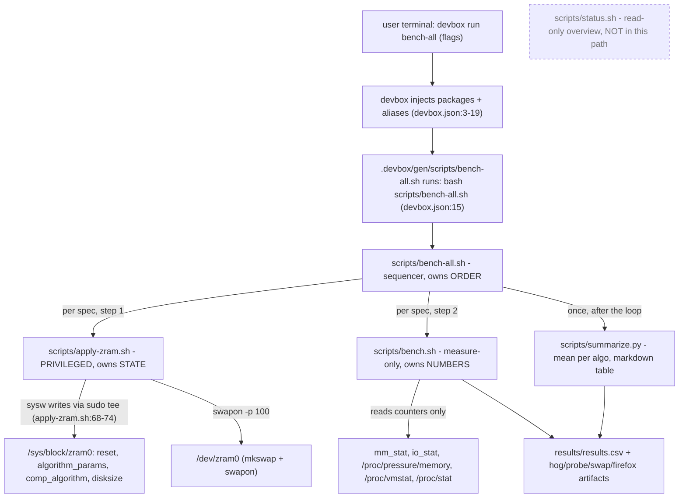
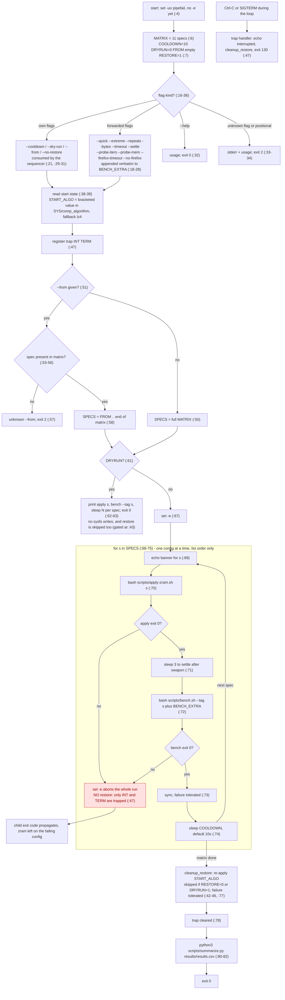
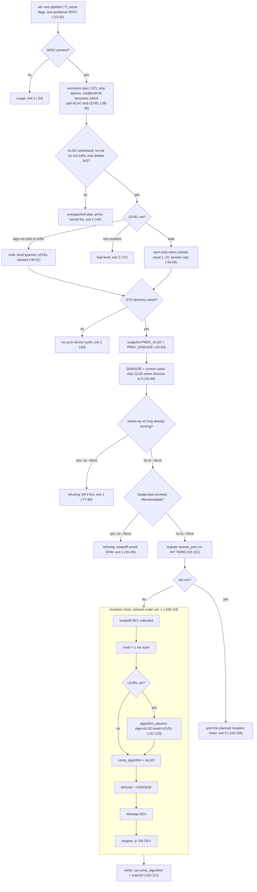
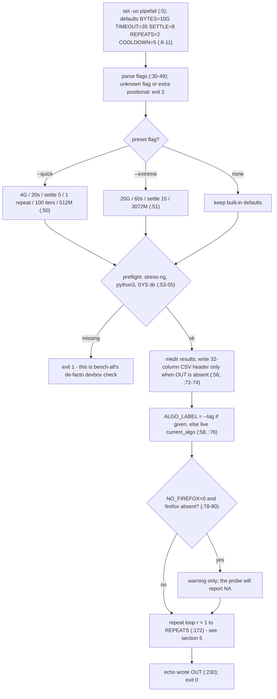
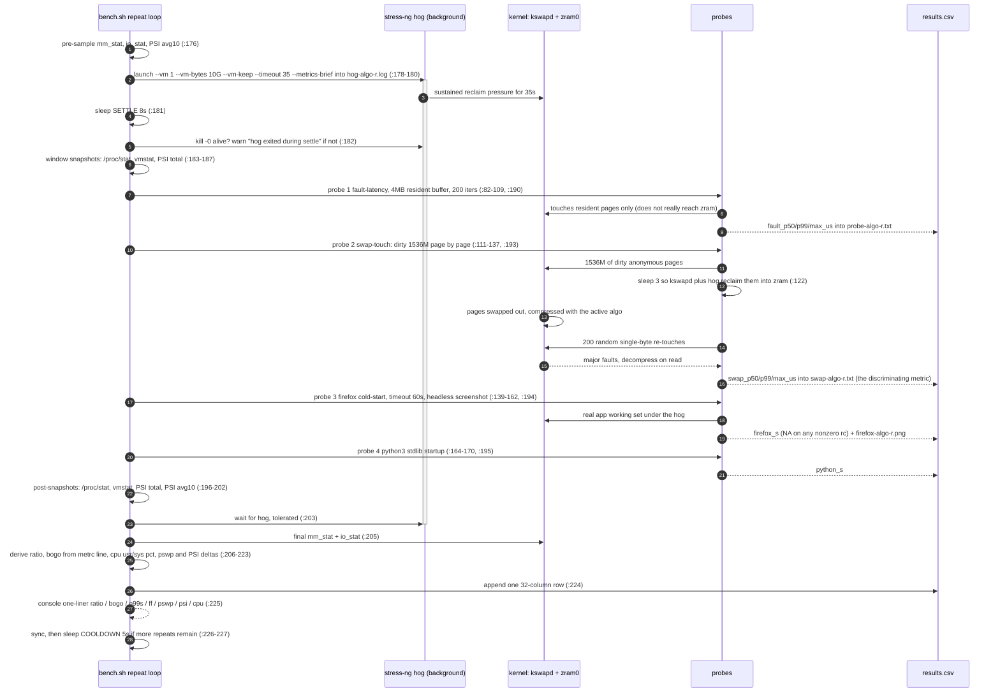

# bench-all flow

How `devbox run bench-all` walks the zram compression matrix: **apply → bench → cooldown**, per
algorithm, then restore and summarize.

**How to read this.** Every node is annotated with `file:line` (relative to this repo). Diagrams
match the tree at commit `a469044`. Line references inside a diagram are relative to the script
named in that section's heading.

The harness splits responsibility three ways (see `AGENTS.md`:3):

| Layer | Script | Owns | Privileged? |
|---|---|---|---|
| order | `scripts/bench-all.sh` | which config runs next, restore point, cooldown | no |
| state | `scripts/apply-zram.sh` | mutating `/sys/block/zram0` | **yes** (`sudo tee`) |
| numbers | `scripts/bench.sh` | load generation + measurement only | no |

---

## 1. Who calls whom



`bench.sh` never writes `comp_algorithm` — the only reason it appears in the privileged path is
that the hog it starts makes `apply-zram.sh`'s guards relevant (§3).

---

## 2. Main sequencer (`scripts/bench-all.sh`)



### The asymmetry worth memorizing

| Event | Restore of `START_ALGO`? | Exit code |
|---|---|---|
| loop completes | yes (`:77`) | 0 |
| Ctrl-C / SIGTERM | yes, then exit (`:47`) | 130 |
| `apply-zram.sh` or `bench.sh` fails | **no** — no `ERR`/`EXIT` trap | child's code |
| `--dry-run` | never attempted (`:43`) | 0 |
| `--no-restore` | never attempted (`:43`) | 0 |

The comment at `:66` says "fail fast on error but always restore"; only the interrupt path
actually restores. Resume a truncated run with `--from <spec>` (`:50-59`).

Two small traps in the code itself: `--repeats` is captured at `:20` but never used by the
sequencer (the repeat loop lives in `bench.sh:172`), and value flags `shift 2` without a
`${2:-}` guard (`:20-30`), so a missing value trips `set -u` rather than printing usage.

`START_ALGO` is read from sysfs, which reports bare `zstd` and not `zstd:8` — so a run that
started on a zstd *level* restores unlevelled `zstd` (`:39` → `:45`).

---

## 3. Sub-flow: `apply-zram.sh` (the privileged step)



`sysw` (`:70-74`) is the privilege boundary: direct `>` redirect when `EUID` is 0, otherwise
`echo | sudo tee`. This is the only script in the harness that writes kernel state, and the only
one that may prompt for a password.

Note `restore_prev` (`:92-101`) unwinds to `PREV_ALGO` **and** `PREV_DISKSIZE`, and it runs on
interrupt only — a mid-chain failure under `set -e` leaves the device in whatever state the last
successful write produced.

The two guards exist for one reason each: a running hog would be swapped-out-from under, and
`swapoff` forces every swapped page back into RAM — with `SwapUsed > MemAvailable` that is the
OOM that killed the 16G run (`JOURNAL.md`:27-32).

---

## 4. Sub-flow: `bench.sh` (measure-only)



### Defaults, and why they are what they are

| Knob | default | `--quick` | `--extreme` | Reason |
|---|---|---|---|---|
| `BYTES` (hog) | 10G | 4G | 20G | 16G on this 14.9 GiB box is what `systemd-oomd` killed; a plain `bench-all` forwards nothing, so the default itself must be safe (`JOURNAL.md`:20-25) |
| `TIMEOUT` | 35s | 20s | 60s | raised from 30s: probes need the `timeout - settle` window, 35-8 = 27s (`JOURNAL.md`:6-11) |
| `SETTLE` | 8s | 5s | 15s | wait for the hog to reach steady pressure before probing |
| `REPEATS` | 2 | 1 | 2 | means per algo in the summary table |
| `PROBE_MEM_MB` | 1536 | 512 | 3072 | swap-touch buffer that must actually get reclaimed |
| `PROBE_ITERS` | 200 | 100 | 200 | latency samples |
| `FIREFOX_TIMEOUT` | 60s | 60s | 60s | hard cap via `timeout`; firefox never aborts a run |
| `COOLDOWN` (inter-repeat) | 5s | 5s | 5s | `bench.sh:8`, distinct from bench-all's 10s inter-algo cooldown |

Stale comment: the header example at `bench.sh:3` still says `--timeout 30`, while the real
default is `TIMEOUT=35` (`:8`) and `usage()` prints 35 (`:23`).

---

## 5. One repeat, in wall-clock order



Timeline band for the default configuration (probes must fit inside the 27s window):

```text
t=0s        8s                              ~35s        35s+overage
|--sleep 8--|                               |           
|           | fault probe | swap-touch:     |           |
|           | (200 iters) | dirty + sleep 3 |           |
|           |             | + 200 faults    |           |
|           |             | firefox (<=60s cap, ~1s)    |
|           |             | python startup  |           |
|  stress-ng --vm 1 --vm-bytes 10G --timeout 35 --------|  (background, waits gate it)
             ^window opens (:183)                        ^window closes (:196)
```

Why the swap-touch probe sleeps: `bench.sh:112-113` records that without the 3s pause the buffer
stays hot and resident at roughly 0.4 µs, so zram decompression is never exercised — which is
exactly the flaw that made the old fault probe useless (`JOURNAL.md`:15-16, flat ~15 µs across
all algorithms with PSI 0/0).

---

## 6. Artifacts and exit codes

Nothing in `results/` is tracked — `.gitignore:5-6` excludes it as machine-specific output.

| Artifact | Written by | Notes |
|---|---|---|
| `results/results.csv` | `bench.sh:72-74` header, `:224` row | 32 columns, one row per repeat, **appended**; bench-all passes no `--out`, so the whole matrix lands in one file |
| `results/hog-<algo>-r<r>.log` | `bench.sh:178-179` | `stress-ng --metrics-brief` output; the `metrc:` line yields bogo ops/s; path also stored in the `notes` column |
| `results/probe-<algo>-r<r>.txt` | `bench.sh:188` | raw µs samples, fault probe |
| `results/swap-<algo>-r<r>.txt` | `bench.sh:191` | raw µs samples, swap-touch probe |
| `results/firefox-<algo>-r<r>.png` | `bench.sh:147, :151` | screenshot of `about:blank` from a throwaway `mktemp -d` profile |
| archived run dirs, e.g. `results/2026-09-26_1906_run/` | manual | full 11-algo x 2-repeat runs |
| summary table | `bench-all.sh:82` → `summarize.py` | means per algo, sorted by swap p99, then firefox s, then PSI-full-total (`summarize.py:35-50`); falls back to a fault-only table for old CSVs (`summarize.py:53-66`) |

In filenames `<algo>` is the `--tag` value with `/` replaced by `_` (`bench.sh:147, :178, :188`);
the current matrix contains no slashes.

| Script | exit 0 | exit 1 | exit 2 | exit 130 |
|---|---|---|---|---|
| `bench-all.sh` | completed run, `--help`, `--dry-run` | none of its own | usage, unknown flag, unknown `--from` | interrupt, **after** restore |
| `apply-zram.sh` | switch applied, `--help`, `--dry-run` | missing sysfs dir, hog guard, SwapUsed guard | missing spec, bad algo, bad level, unknown flag | interrupt, **after** `restore_prev` |
| `bench.sh` | rows written | preflight: no stress-ng, no python3, no `$SYS` | usage, unknown flag, extra positional | none; probes degrade to `NA` instead of failing (`:141-142, :159`) |

---

## 7. Running it

```bash
devbox run bench-all -- --dry-run                        # print the plan, touch nothing
devbox run bench-all -- --quick                          # one repeat, 4G, fastest real signal
devbox run bench-all                                     # full matrix at OOM-safe 10G/35s/8s
devbox run bench-all -- --from zstd:8 --no-restore       # resume, keep last algo active
```

- Run through `devbox` (packages at `devbox.json:3-10`); `bench.sh` exits 1 without `stress-ng`.
- Paths are relative (`scripts/...`, `results/...`), so the working directory must be the repo root.
- `apply-zram.sh` may prompt for `sudo`, so the full matrix is an **interactive** run
  (`JOURNAL.md`:32). Expect roughly 11 configs x (35s hog + 3s settle + cooldown + per-algo apply
  overhead) x repeats.
- A small box is not the constraint on hog size alone — the swap probe needs enough `--bytes` and
  `--probe-mem` that kswapd actually evicts, otherwise `swap_p99` stays flat near 1 µs
  (`JOURNAL.md`:18).
- Check live state without touching it: `devbox run status`.

**Read next:** `JOURNAL.md` (why each default moved), then the scripts themselves —
`scripts/bench-all.sh` is 83 lines.
